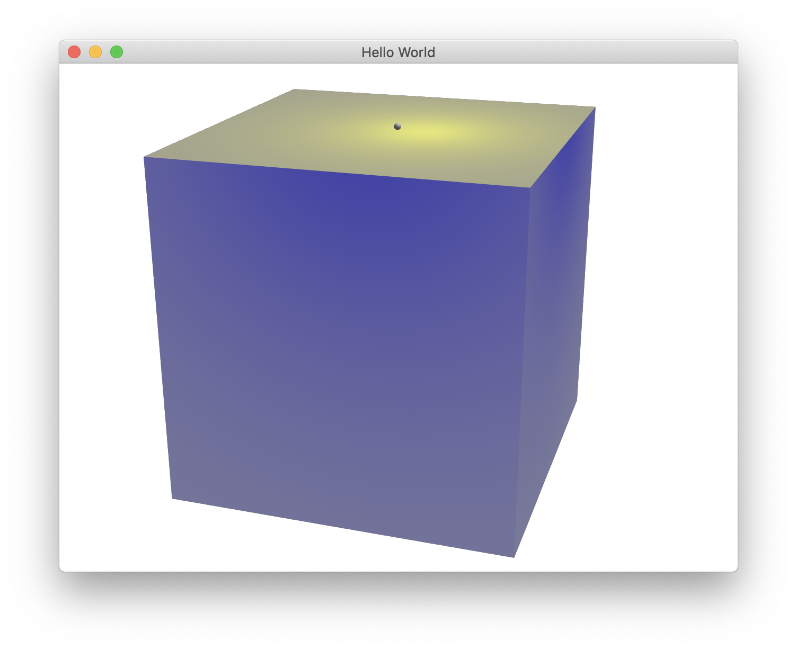

1. *main.cpp* загружает *init.qml*.
2. *init.qml* через элемент типа ```Loader``` загружает *main.qml*.
3. *main.qml* содержит элемент типа ```QuickViewHolder``` (определен в *QuickViewHolder.qml*).
4. Компонент ```QuickViewHolder``` содержит элемент типа ```MyQuickView``` (определен на С++, наследник ```QQuickView```).
5. Этот элемент типа ```MyQuickView``` загружает через свойство ```source``` *QuickItemHolder.qml*.
6. *QuickItemHolder.qml* содержит элемент ```MyQuickItem``` (определен на С++, наследник ```QQuickItem```).
